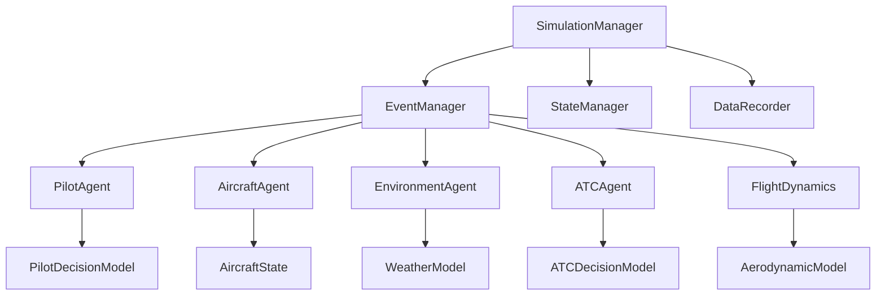

# Architecture Guide

This document provides a comprehensive overview of the VFT_SMF (Virtual Flight Test Simulation and Modeling Framework) architecture, design principles, and component interactions.

## 🏗️ System Overview

VFT_SMF is built on a sophisticated digital twin architecture with event-driven multi-threaded simulation capabilities. The system is designed for high-performance, scalable, and extensible flight simulation.

### Core Design Principles

- **🔄 Digital Twin Architecture**: Complete digital representation of physical systems
- **⚡ Event-Driven Design**: Asynchronous event processing for real-time performance
- **👥 Multi-Agent Modeling**: Distributed agent-based simulation
- **🔧 Modularity**: Highly modular design for easy extension
- **📊 Real-time Data**: Continuous data recording and analysis

## 🏛️ High-Level Architecture

```
┌─────────────────────────────────────────────────────────────┐
│                    VFT_SMF Framework                        │
├─────────────────────────────────────────────────────────────┤
│  ┌─────────────┐  ┌─────────────┐  ┌─────────────┐         │
│  │   Pilot     │  │  Aircraft   │  │Environment  │         │
│  │   Agent     │  │   Agent     │  │   Agent     │         │
│  └─────────────┘  └─────────────┘  └─────────────┘         │
│                                                             │
│  ┌─────────────┐  ┌─────────────┐  ┌─────────────┐         │
│  │     ATC     │  │   Flight    │  │ Simulation  │         │
│  │   Agent     │  │ Dynamics    │  │  Manager    │         │
│  └─────────────┘  └─────────────┘  └─────────────┘         │
├─────────────────────────────────────────────────────────────┤
│                    Event Management System                  │
├─────────────────────────────────────────────────────────────┤
│                    Data Recording & Visualization           │
└─────────────────────────────────────────────────────────────┘
```

## 🔄 Digital Twin Architecture

### Three-Layer Digital Twin Model

#### 1. Data Twin Layer
**Purpose**: Physical and mental data representation
```cpp
class DataTwin {
    // Physical state data
    AircraftState physical_state;
    EnvironmentState environment_data;
    
    // Mental state data
    PilotMentalState pilot_mental_state;
    ATCMentalState atc_mental_state;
};
```

#### 2. Model Twin Layer
**Purpose**: Decision-making and control algorithms
```cpp
class ModelTwin {
    // Decision models
    PilotDecisionModel pilot_model;
    AircraftControlModel aircraft_model;
    ATCDecisionModel atc_model;
    
    // Control algorithms
    FlightController flight_controller;
    EngineController engine_controller;
};
```

#### 3. Service Twin Layer
**Purpose**: State management and service interfaces
```cpp
class ServiceTwin {
    // State management
    StateManager state_manager;
    EventManager event_manager;
    
    // Service interfaces
    DataService data_service;
    CommunicationService comm_service;
};
```

## ⚡ Event-Driven Architecture

### Event System Design

```cpp
// Event base class
class Event {
    EventType type;
    Timestamp timestamp;
    EventPriority priority;
    virtual void execute() = 0;
};

// Event types
enum EventType {
    PILOT_ACTION,
    AIRCRAFT_STATE_CHANGE,
    ENVIRONMENT_UPDATE,
    ATC_COMMAND,
    SYSTEM_EVENT
};
```

### Event Processing Flow

```
1. Event Generation
   ↓
2. Event Queue (Priority-based)
   ↓
3. Event Dispatcher
   ↓
4. Event Handlers
   ↓
5. State Updates
   ↓
6. New Events Generated
```

## 👥 Multi-Agent Modeling System

### Agent Architecture

Each agent follows a consistent architecture:

```cpp
class Agent {
protected:
    // Agent state
    AgentState current_state;
    
    // Decision making
    DecisionEngine decision_engine;
    
    // Communication
    MessageQueue message_queue;
    
public:
    virtual void update(double delta_time) = 0;
    virtual void handleEvent(const Event& event) = 0;
    virtual void communicate() = 0;
};
```

### Agent Types

#### 1. Pilot Agent
- **Responsibilities**: Flight control decisions, navigation
- **Key Components**: Decision model, skill level, fatigue model
- **Interfaces**: Aircraft controls, ATC communication

#### 2. Aircraft Agent
- **Responsibilities**: Physical aircraft simulation, systems management
- **Key Components**: Flight dynamics, engine model, systems
- **Interfaces**: Control inputs, environmental conditions

#### 3. Environment Agent
- **Responsibilities**: Weather, terrain, atmospheric conditions
- **Key Components**: Weather model, terrain database, wind model
- **Interfaces**: Environmental data provision

#### 4. ATC Agent
- **Responsibilities**: Air traffic control, separation management
- **Key Components**: Traffic management, communication protocols
- **Interfaces**: Pilot communication, traffic monitoring

#### 5. Flight Dynamics Agent
- **Responsibilities**: Aerodynamic calculations, flight physics
- **Key Components**: Aerodynamic model, mass properties, control surfaces
- **Interfaces**: Aircraft state, control inputs

## 🔧 Component Architecture

### Core Components

```
src/
├── A_PilotAgentModel/         # Pilot agent implementation
│   ├── PilotDecisionModel.cpp
│   ├── PilotState.cpp
│   └── PilotCommunication.cpp
├── B_AircraftAgentModel/      # Aircraft digital twin
│   ├── AircraftState.cpp
│   ├── AircraftSystems.cpp
│   └── AircraftController.cpp
├── C_EnvironmentAgentModel/   # Environment simulation
│   ├── WeatherModel.cpp
│   ├── TerrainModel.cpp
│   └── AtmosphericModel.cpp
├── D_ATCAgentModel/          # ATC agent
│   ├── ATCDecisionModel.cpp
│   ├── TrafficManagement.cpp
│   └── ATCAgentCommunication.cpp
├── E_FlightDynamics/         # Flight physics
│   ├── AerodynamicModel.cpp
│   ├── EngineModel.cpp
│   └── FlightController.cpp
├── F_ScenarioModelling/      # Scenario management
│   ├── FlightPlanParser.cpp
│   ├── ScenarioManager.cpp
│   └── WaypointManager.cpp
└── G_SimulationManager/      # Core simulation
    ├── SimulationEngine.cpp
    ├── EventManager.cpp
    ├── StateManager.cpp
    └── DataRecorder.cpp
```

### Component Interactions



## 📊 Data Flow Architecture

### Data Flow Patterns

1. **State Updates**: Continuous state propagation through agents
2. **Event Propagation**: Asynchronous event handling across components
3. **Data Recording**: Real-time data capture and storage
4. **Visualization**: Real-time data visualization and analysis

### Data Structures

```cpp
// Core data structures
struct AircraftState {
    Position position;
    Velocity velocity;
    Attitude attitude;
    EngineState engine_state;
    SystemStatus system_status;
};

struct Event {
    EventType type;
    Timestamp timestamp;
    EventData data;
    Priority priority;
};

struct SimulationState {
    double current_time;
    std::vector<AgentState> agent_states;
    EnvironmentState environment;
    std::queue<Event> pending_events;
};
```

## 🔄 Synchronization and Timing

### Multi-threaded Architecture

```cpp
class SimulationEngine {
private:
    std::vector<std::thread> agent_threads;
    std::mutex state_mutex;
    std::condition_variable sync_cv;
    
public:
    void runSimulation();
    void synchronizeAgents();
    void handleEvents();
};
```

### Timing Control

- **Fixed Time Step**: Configurable simulation time step (default: 0.01s)
- **Real-time Synchronization**: Optional real-time execution
- **Event Scheduling**: Priority-based event execution
- **State Synchronization**: Thread-safe state management

## 🔧 Extension Points

### Plugin Architecture

```cpp
// Plugin interface
class Plugin {
public:
    virtual void initialize() = 0;
    virtual void update(double delta_time) = 0;
    virtual void cleanup() = 0;
};

// Plugin manager
class PluginManager {
    std::vector<std::unique_ptr<Plugin>> plugins;
public:
    void loadPlugin(const std::string& plugin_path);
    void unloadPlugin(const std::string& plugin_name);
};
```

### Custom Agent Development

```cpp
// Custom agent example
class CustomAircraftAgent : public AircraftAgent {
public:
    void update(double delta_time) override;
    void handleEvent(const Event& event) override;
    
private:
    CustomAerodynamicModel custom_aero_model;
    CustomEngineModel custom_engine_model;
};
```

## 📈 Performance Considerations

### Optimization Strategies

1. **Memory Management**: Object pooling, smart pointers
2. **Threading**: Optimal thread count, load balancing
3. **Data Structures**: Efficient containers, cache-friendly access
4. **Algorithms**: Optimized mathematical computations

### Scalability Features

- **Distributed Simulation**: Multi-node simulation support
- **Load Balancing**: Dynamic agent distribution
- **Resource Management**: Efficient resource allocation
- **Parallel Processing**: Multi-core optimization

## 🔒 Security and Safety

### Safety Measures

- **Input Validation**: Comprehensive input checking
- **State Validation**: State consistency verification
- **Error Handling**: Robust error recovery
- **Logging**: Comprehensive audit trails

### Security Features

- **Access Control**: Role-based access management
- **Data Encryption**: Sensitive data protection
- **Network Security**: Secure communication protocols
- **Audit Logging**: Security event recording

---

*For implementation details, see the [API Reference](API_Reference.md) and [Module Development Guide](Module_Development.md).*
